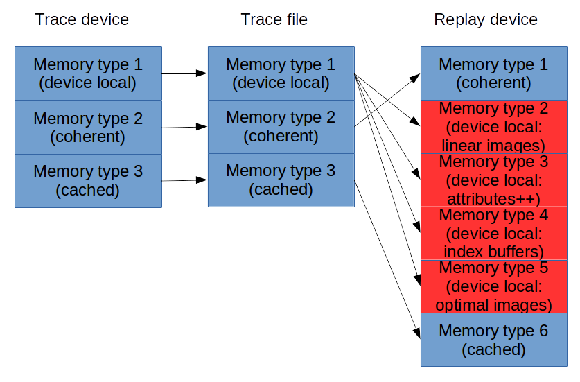

Memory Management
=================

Introduction
------------

Other Vulkan tracers mostly use what we can call allocation-based memory tracing,
where each memory allocation is tracked. Lavatube instead does what we can call
an object-based memory tracing, which means we ignore how the traced application
does memory allocation and instead create our own memory pools from which we
suballocate memory for Vulkan objects (images or buffers).

What the problem is
-------------------

The allocation based memory management approach seems impossible in theory to work
reliably in a cross-platform manner. Consider the following example:

Here objects cannot remain in the same device memory objects during replay as they
were during tracing, since the replay platform requires them to be split into
multiple memory types, whereas the trace platform does not permit them to be split.

In addition, images and buffers may be larger on the replay system, so if they are
suballocated into the same VkDeviceMemory area by the traced app, they will overlap
each other on replay. They can also have different alignment restrictions.

How it works - basics
---------------------

All calls to vkAllocateMemory, vkMapMemory, and vkUnmapMemory are ignored on
replay.

We keep track of how the traced application suballocates its allocated memory
by looking at calls to vkBind{Buffer|Image}Memory{2|2KHR}.

We create instead 'object update packets' with diffs of the memory used by the
image or buffer in the file whenever we encounter a queue submit, sending work
to the GPU.

On the replay side, we query the memory requirements for the object again on
creation, and puts it into a memory type and using a memory size appropriate
for the replay host.

Images and buffers are treated differently when it comes to making sure we
have portable sized updates stored on disk. For buffers, we keep track of the
actually used size of buffers, and save that instead of the actually allocated
amount of memory (which includes padding due to alignment restrictions). For
images, we instead make sure that allocations on the replay host are at least
as large as those on the trace host, since knowing the actually used size of
images can be tricky.

Memory types
------------

One fundamental problem with Vulkan tracing is that API user never has to tell
the API _why_ he or she wants to a particular thing. For picking memory types,
this is particularly annoying when going from a platform with few, feature-
packed memory types to a platform with many memory types, each with few
features. For example, if a user has picked a memory type with both device local
and host visible flags on one platform, which is possible on some platforms,
then we cannot know which is these is actually needed (you never need both).
To figure this out, we intercept and split such feature-rich memory types while
tracing, presenting the app with virtual memory types and forcing the user to
tell us which feature that is important.

Memory pools
------------

The number of memory pools depends on the number of threads and the number of used
memory types, as we need one memory pool for each memory type (obviously), and
also one for each thread, to avoid expensive memory synchronization. Each thread
will create objects in its own memory pool, while other threads are free to access
and change the memory, memory access must be handled by the traced application as
usual, while destruction of the memory suballocations are put on a free list that
waits for further allocations before actually carrying out the free.

Memory Tracking
===============

Where most other Vulkan tracers use guard pages, lavatube uses tracking and diffing
any memory actually used as determined on queue submit. There is no need for thread
synchronization except at the point of queue submission.

Making it fast
--------------

Some applications use a lot of persistent memory maps and/or suballocate from giant
VkBuffers. This makes a track-and-diff approach like this either quite complicated
or quite slow. Obviously we don't want it to be slow, so it has ended up complicated.

We track two types of memory ranges: Exposed device memory, and touched command
buffer memory objects. Any memory that is memory mapped become exposed, and are only
made not exposed again if scanned for changes while it is no longer mapped. Such
scanning happens at queue submit time, when all touched memory ranges owned by
objects touched by the submitted command buffer are scanned. The lists of touched
ranges are created along with command buffers and are immutable.

This dual structure of memory ranges tries to sure we only scan the minimum of memory
that we need to scan. However, suballocations from giant VkBuffers can still be very
slow as we may need to make pessimistic assumptions about which memory areas are going
to be read from. Much more work could be done here to speed things up.

Memory usage
------------

We currently make copies of the entire memory object of any VkDeviceMemory mapped to
the host using vkMapMemory(). This is because we need to keep track of changes for
when we eventually check these objects at the time of queue submission. We also
currently do not free this memory unless the memory object is destroyed, on the
assumption that it will probably be used in the same manner again soon.

Memory aliasing
---------------

This is currently unsupported but some types of memory aliasing should be supportable.
